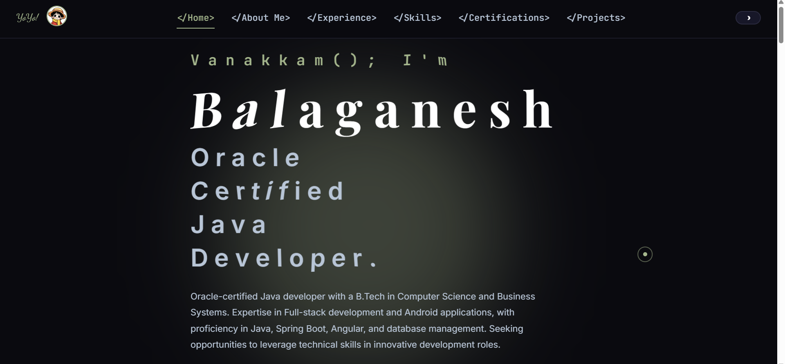

# Balaganesh's Portfolio
Welcome to my professional portfolio, where I showcase my journey as a passionate software developer and problem solver. With a focus on creating impactful projects, I bring a blend of technical expertise and creativity to every endeavor. Explore my projects and skills, all crafted to provide a seamless user experience across devices.

## Screenshots
HOW IT WORKS ON LAPTOP/PC LANDSCAPE:

HOW IT WORKS ON MOBILE VERTICAL:

Key Features:
1.Responsive Design: Optimized for both laptop and mobile devices, ensuring a smooth browsing experience regardless of screen size.

2.Dark & Light Modes: Switch effortlessly between dark and light modes to suit your preference, offering a comfortable viewing experience in any environment.

3.Project Highlights: A curated selection of my most notable projects, complete with descriptions, tech stacks, and live demos.

4.Contact & Social Links: Easy access to my LinkedIn, GitHub, and email for quick connections and collaboration.

## Introduction
Hi! I’m Balaganesh, a passionate developer with a focus on Java and web technologies. I'm currently pursuing a B.Tech in Computer Science and Business Systems and am dedicated to implementing innovative solutions.

I have created both dark and light modes for my projects, enhancing user experience by accommodating different preferences and lighting conditions. This feature showcases my attention to detail and commitment to usability.

## Skills
- **Programming Languages Used**: HTML, CSS,JavaScript
- **Tools**: Git, GitHub, Visual Studio Code

## Contact Information
- **Email**: sbbalaganesh2004@gmail.com
- **LinkedIn**: www.linkedin.com/in/balaganesh-sb

## Acknowledgments
Thanks to everyone who has supported me in my journey!
