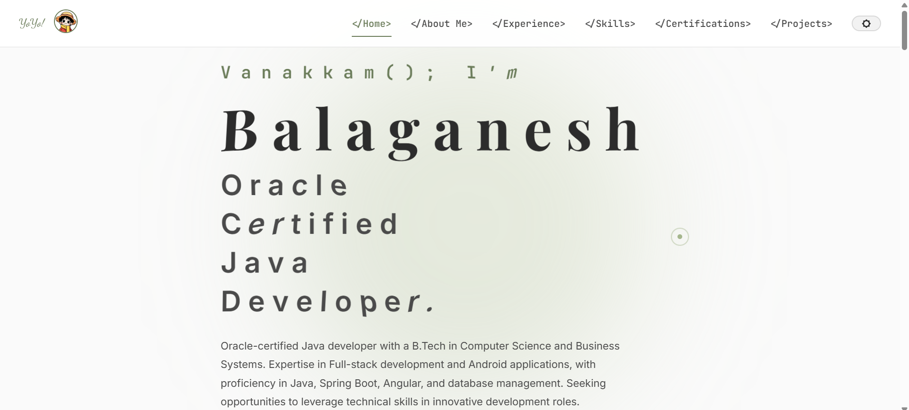
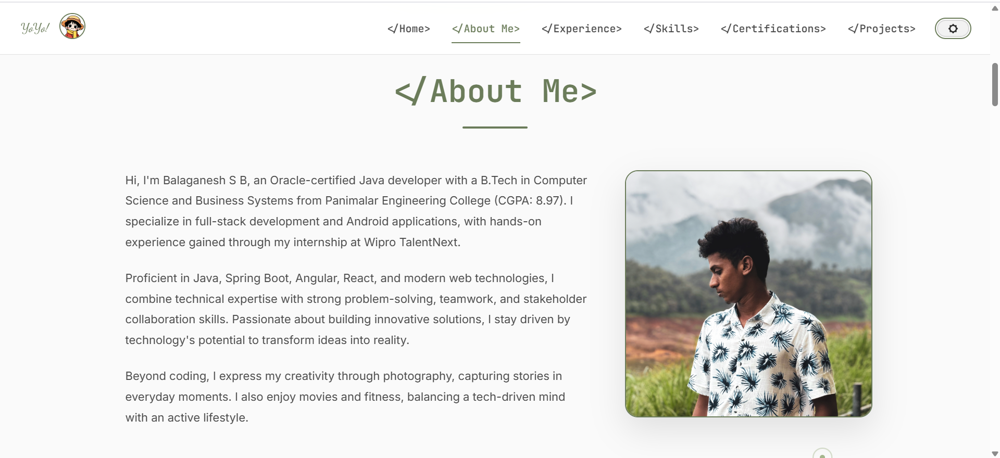

# Balaganesh's Portfolio

[](https://bala1403.github.io/portfolio/)
[](https://github.com/BALA1403/portfolio)

Welcome to my professional portfolio, where I showcase my journey as a passionate software developer and problem solver. With a focus on creating impactful projects, I bring a blend of technical expertise and creativity to every endeavor. Explore my projects and skills, all crafted to provide a seamless user experience across devices.

## 🚀 Live Demo

[View Live Portfolio](https://bala1403.github.io/portfolio/) | [Source Code](https://github.com/BALA1403/portfolio)

## 📱 Screenshots

### Desktop/Laptop View (Landscape)








### Mobile View (Portrait)


## ✨ Key Features

1. **Responsive Design**: Fully optimized for desktop, tablet, and mobile devices, ensuring a smooth browsing experience across all screen sizes with modern CSS Grid and Flexbox layouts.

2. **Dark & Light Mode Toggle**: Switch effortlessly between dark and light themes with a sleek toggle button, offering comfortable viewing in any lighting environment with smooth transitions.

3. **Interactive Project Showcase**: A curated selection of my most notable projects, complete with detailed descriptions, technology stacks, live demo links, and GitHub repositories.

4. **Smooth Animations**: Engaging CSS animations and transitions that enhance user experience without compromising performance.

5. **Contact Integration**: Easy access to my professional profiles (LinkedIn, GitHub) and direct email contact with a functional contact form.

6. **SEO Optimized**: Structured with semantic HTML and meta tags for better search engine visibility.

## 🛠️ Technologies Used

### Frontend
- **HTML5**: Semantic markup and accessibility features
- **CSS3**: Modern styling with Grid, Flexbox, and custom properties
- **JavaScript (ES6+)**: Interactive functionality and DOM manipulation

### Tools & Workflow
- **Git & GitHub**: Version control and project hosting
- **Visual Studio Code**: Primary development environment
- **Responsive Design**: Mobile-first approach with breakpoints
- **Cross-browser Testing**: Ensuring compatibility across modern browsers

## 📂 Project Structure

```
portfolio/
├── index.html
├── css/
│   ├── style.css
│   └── responsive.css
├── js/
│   └── script.js
├── src/
│   ├── screenshots/
│   └── assets/
└── README.md
```

## 📄 License

This project is open source and available under the [MIT License](LICENSE).

---

**Built with ❤️ by Balaganesh** | **Last Updated**: January 2025